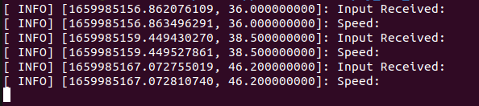
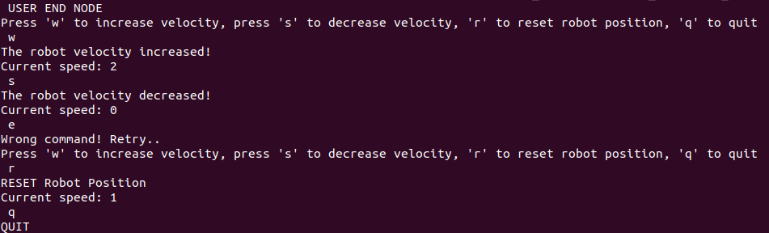
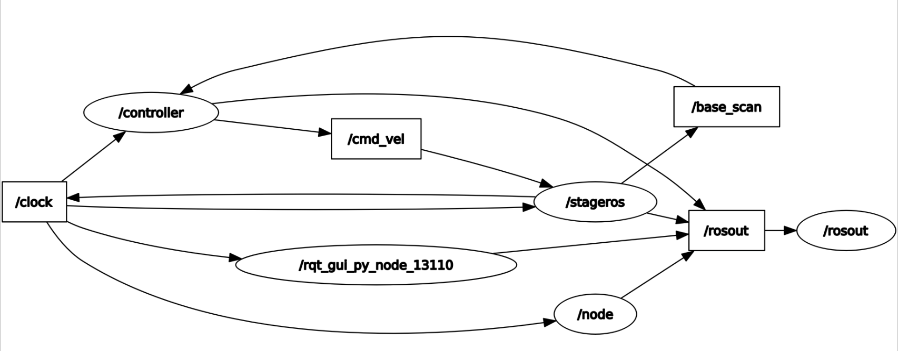

# RT1_Assignment 2
# By Subhransu Priyadarshan & Supervised by Prof. Carmine Recchiuto
================================

This assignment focuses on moving a robot autonomously in a circuit provided with the help of ROS.We are supposed to create a publisher and subscriber and be able to make the nodes communicate with each other in such a way that that it takes the input from the keyboard and modify the velocities inside the robot.


__AIM OF THE PROJECT__
----------------------

The aim of the project is to control the robot using ROS. Although it sounds easy, we need to keep in mind certain parameters and aspects in order to achieve the goal.The robot is also endowed with lasers.We also need two nodes to carry out the simulation (described below in further sections).Here's a list of commands (e.g. keyboard keys) the user can use to control the robot:
+ `w`: increases the speed of the robot, every time '__w__' key is pressed __the velocity is doubled up__;
+ `s`: decreases the speed of the robot, every time '__s__' key is pressed __the velocity is halved__;
+ `r`: __resets the position__ of the robot and sets the velocity to the original form;
+ `q`: __quits__ the nodes in the current package.

Given below is the simulation environment where we are required to automate the robot after building the workspace.


__SIMULATION__
----------------------

The simulator requires _ROS Noetic_ system. Once downloaded, open a terminal and move to the workspace directory, then run this command to build the workspace:

```bash
 catkin_make 
 
```
It is used to properly build the workspace.

Now you have to launch all the nodes, here's a list of the needed nodes to properly run the project:

- `Master`: It provides the naming and registration to the rest of the nodes in the ROS system.
- `stage_ros`: The stage_ros node wraps the Stage 2-D multi-robot simulator, via libstage. Stage simulates a world as defined in a .world file. This file tells stage everything about the world, from obstacles (usually represented via a bitmap to be used as a kind of background), to robots and other objects.
- `controller_node`: implements the logic of the navigation inside the circuit and provides a service that changes the speed of the robot.
- `user_interface_node`: User Interface node, used for receiving commands via keyboard input.


__Run the Simulation__ 

You can launch the nodes one by one:


First of all, you need to launch the master node:
```bash
 roscore & 
```
 launch the master node
 
Now open a new terminal, then run the node __stageros__:
```bash
 rosrun stage_ros stageros $(rospack find second_assignment)/world/my_world.world #run stageros node
```
At this point a window with the circuit should appear, after opening a new terminal again run the node __controller_node__:
```bash
 rosrun second_assignment controller_node  
```
run controller_node node

The robot should start moving, open a new terminal again, then run the last node (__user_interface_node__):
```bash
 rosrun second_assignment user_interface_node 
```
run user_interface_node node


__NODES IMPLEMENTED__
----------------------

In the _src_ folder of the package you will find two _.cpp_ files, __mycontroller.cpp__ and __user_end.cpp__ whose executables correspond to the two nodes __controller_node__ and __user_interface_node__. 

__controller_node__

This node is the one that allows the robot to lap around the circuit. To do that, it makes a subscription to `/base_scan` topic, published by `stageros` node, whose message type is `sensor_msgs/LaserScan.msg`. In our case, we're interested to the __ranges[]__ Vector that contains, in the i-th positiknnon, the distance from the wall of the i-th laser (721 elements) in a range of 180 degrees. As you can imagine, these values are key elements for the robot's movement as they allow it to be aware of the obstacles surrounding it and consequently move in the appropriate direction. For this reason, the logic with which the robot decides to move is implemented directly in the callback function (__driveCallback__) that is invoked every time a new message of this type is published. This function also implements a _Publisher_ for the `/cmd_vel` topic, in which you can publish messages of type `geometry_msgs/Twist.msg` to make the robot move. The fields of this message consist of six _float32_ variables representing _linear_ and _angular_ velocity along the three axis _x_,_y_ and _z_.
This node also implements a server for the service that manages the user inputs designed for changing the velocity (e.g. 'w' and 's' keys, respectively for accelerating and decelerating). Every time user types one of those two keys from the shell where user_interface_node is running, it makes a request for the `/changeVel` service. The structure of this service is:
- __Request__: char `input`
- __Response__: float32 `multiplier`

If the input corresponds to the char ‘__w__’, the response will be such as to double the speed, if the input corresponds to the char ‘__s__’, the response will be such as to halve the speed.

__driveCallback function__

As already explained before, this function retrieves information from `/base_scan` topic and publishes to `/cmd_vel` topic to make the robot move. 
The `LaserScan.msg` contains a lot of information, but the most important one is __ranges[]__ Vector from which you are able to get the distances from the wall for each of 721 lasers (i-th laser corresponds to i-th position in the Vector). 
To properly drive the robot around the circuit, the values of that Vector I used are related to the lateral and frontal distances:
- __right__: ca. 120 values (from index 0 to 120 of __ranges[ ]__) __-->__ ca. 30 degrees
- __front__: ca. 60 values (from index 330 to 390 of __ranges[ ]__) __-->__ ca. 15 degrees
- __left__: ca. 120 values (from index 600 to 720 of __ranges[ ]__) __-->__ ca. 30 degrees


__user_interface_node__

This node is the executable of _user_end.cpp_ file, it is used for receiving inputs from the keyboard, you can find a list of the command . The code related to this node is actually pretty simple, the program constantly waits for user input and when a proper key is pressed, clients make a request for the service used to handle that command. More precisely, it has been sufficient to create two clients that make use of these two services, respectively:
- `/changeVel`: changes the velocity of the robot (server is located in __controller_node__), __keys__: `w`, `s`, `r`;
- `/reset_positions`: resets the position of the robot, __keys__: `r`;

As already explained in __controller_node__ section, `w` and `s` keys will make a request such as to double or halve the velocity, `r` key resets the position by sending a request to `/reset_positions` but it also sends another request to `/changeVel` service such as the velocity will be reset to the original value (equals to 1).

The last valid key that user can press is the `q` one and it is just used for closing the node.

The output on the terminal can be seen below :



You can also see the output at the user end :


__rqt_graph command__
----------------------
The `rqt_graph` command provides a GUI plugin for visualizing the ROS computation graph. It is useful to have an immediate comprehension of how nodes and related topics work together. In this case, the resulting graph is fairly simple because there are only three nodes (represented as elliptical boxes) and two topics (represented as rectangular boxes).

To visualize the graph, you only need to run:
```bash
 rqt_graph 
```

The structure for communnication of the program can be seen in the the figure below:




__PSEUDOCODE__

+ begin
+ check if the robot is near to the wall infront of it
 + if yes
  then check if the distance from left wall is lesser than (or equal to) the right wall
 + else
  drive front
+ check if the distance is much lower
 + if yes
  then turn right
 + else
  then drive front
+ check if the distance from right wall is lesser than the one on the left,is that distance much lower 
 + if yes
  then turn left
 + else
  then drive front


__CONCLUSION AND IMPROVEMENTS__
----------------------

As we can see from the assignment, velocity of the robot is one of the most important factors that needs to be taken into consideration.The velocity cannot be increased too much and it is the utmost priority to give it a proper multiplier. If the multiplier is (say 2.0) lesser then the robot might follow the path without any hinderance but if it is more, then the robot might crash/hit the wall.

One of the improvements that can be taken into account is that the robot can be made to follow the wall, in order to avoid going with a zig-zag in certain situations.The rstio between the linear and angular velocities might be calculated in order to improve the mobility and avoid collision.


 
